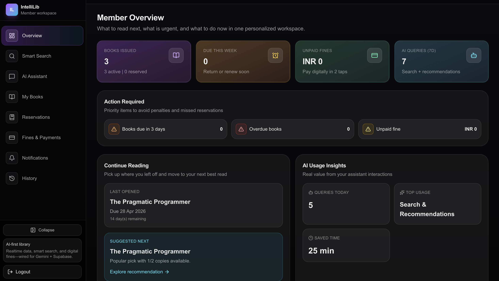
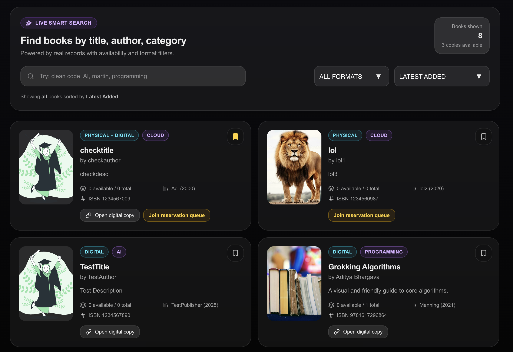
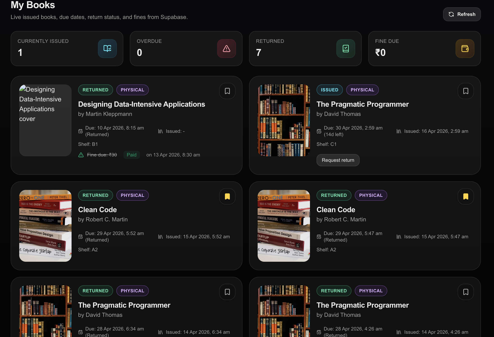
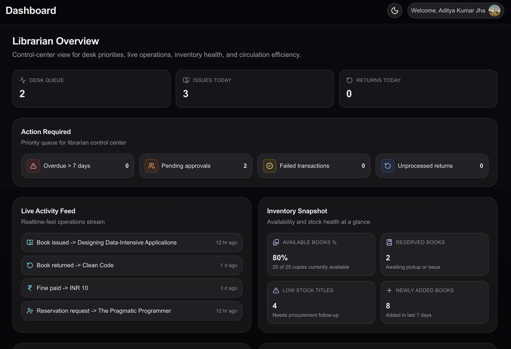
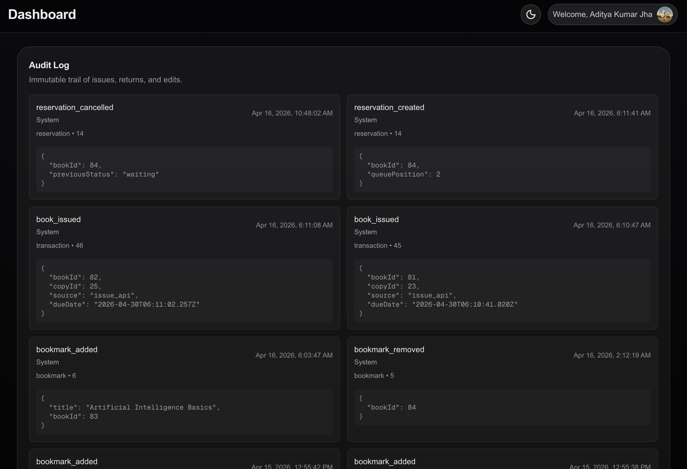
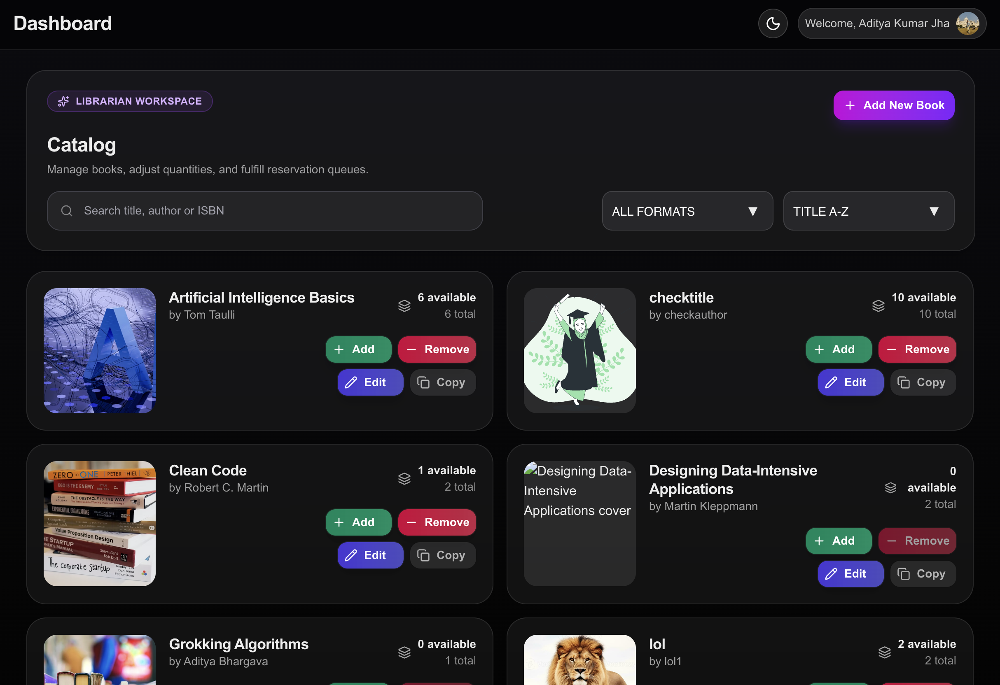

# IntelliLib - AI-Powered Smart Library Management System

<div align="center">



[](LICENSE)


**IntelliLib is a production-oriented smart library platform with AI assistants, role-based dashboards, digital circulation, reservations, and integrated payment/notification workflows.**

**Project Code:** https://github.com/Aditya-KumarJha/intellilib

**Live Deployment:** https://intellilib-hitk.vercel.app/

</div>

---

## Table of Contents

- [Overview](#overview)
- [Core Capabilities](#core-capabilities)
- [Demo Screenshots](#demo-screenshots)
- [Technology Stack](#technology-stack)
- [Architecture](#architecture)
- [Monorepo Layout and File Responsibilities](#monorepo-layout-and-file-responsibilities)
- [API Surface](#api-surface)
- [Database Documentation](#database-documentation)
- [Environment Variables](#environment-variables)
- [Local Setup](#local-setup)
- [Workers and Queue Operations](#workers-and-queue-operations)
- [Testing](#testing)
- [Deployment Notes](#deployment-notes)
- [License](#license)

---

## Overview

IntelliLib is an end-to-end digital library management system built with Next.js App Router and Supabase PostgreSQL. It supports three role experiences:

- User: discover books, reserve, issue, return, pay fines, and monitor status.
- Librarian: manage catalog, issue/return flows, member actions, requests, and audit operations.
- Admin: role management, analytics, circulation oversight, and global settings.

The platform includes:

- AI assistants for user and librarian flows.
- Reservation queue automation and promotion logic.
- Fine and payment lifecycle with Razorpay verification.
- In-app notifications and queued email notifications through RabbitMQ + Resend.
- Row Level Security strategy for role-safe access patterns.

---

## Core Capabilities

### 1) Authentication and Role-Aware Experience

- Supabase authentication-backed user identity.
- Role resolution via `profiles.role`.
- Route-level role guards and dashboard-specific navigation maps.

### 2) Discovery and Search

- Public and authenticated search interfaces.
- Category-aware and title/author search support.
- Book detail view with availability indicators.

### 3) Circulation (Issue, Return, Hold)

- Issue books with policy constraints.
- Return request workflow for member -> librarian processing.
- Book-copy state synchronization and due-date validation logic.

### 4) Reservations and Queue Processing

- Waiting/approved queue management.
- Queue compaction and auto-promotion helpers.
- Worker endpoints for queue health and queue processing.

### 5) Notifications and Messaging

- In-app notifications stored in PostgreSQL.
- Mail queue integration via RabbitMQ (`library_notifications`).
- Dead-letter queue replay support.

### 6) Fines and Payments

- Fine computation and pending/paid tracking.
- Razorpay order creation and signature verification.
- Payment status persistence and notification hooks.

### 7) Observability and Auditability

- Structured audit log table and event writes.
- Action tracing from librarian/admin workflows.
- Integration tests for race conditions and request routes.

---

## Demo Screenshots

All screenshots are available under `public/images/demo`.

### Landing Page


### User Dashboard Overview


### Smart Search



### User Issued Books



### Librarian Dashboard Overview



### Librarian Audit log



### Librarian Workspace



---

## Technology Stack

### Frontend and App Layer

- Next.js 16.2.1 (App Router + TypeScript)
- React 19.2.4
- Tailwind CSS 4
- Framer Motion + Motion
- Zustand (auth store)
- React Query
- Recharts

### Backend Services (inside Next.js APIs)

- Next.js Route Handlers (`src/app/api/...`)
- Supabase JS client and service-role server client
- LangChain + Groq integrations for assistant routes
- Razorpay server integrations

### Messaging and Notifications

- RabbitMQ via `amqplib`
- Resend for email delivery
- Dedicated worker scripts for queue processing

### Tooling and Testing

- TypeScript 5
- ESLint 9
- Vitest 4
- Docker Compose (worker service)

---

## Architecture

### High-Level Runtime Model

1. Browser app (public pages + role dashboards) calls internal API routes.
2. API routes validate auth token from `Authorization: Bearer ...` where required.
3. Server services execute Supabase queries and business rules.
4. Notifications are inserted in-app and optionally queued for email.
5. Scheduled/manual queue processors promote reservations, send reminders, and maintain queue health.

### Domain Components

- Identity Domain: `auth.users` + `public.profiles`
- Catalog Domain: `books`, `book_copies`, `categories`
- Circulation Domain: `transactions`, `reservations`, `return_requests`
- Finance Domain: `fines`, `payments`, `system_settings`
- Communication Domain: `notifications`, mail queue, dead-letter replay
- Governance Domain: `audit_logs`, role helpers, RLS policies

---

## Monorepo Layout and File Responsibilities

```bas
intellilib/                                        # Project root
├── AGENTS.md                                      # Agent instructions for this repo
├── CLAUDE.md                                      # Supplemental AI workflow references
├── README.md                                      # Primary project documentation
├── package.json                                   # Scripts and npm dependencies
├── tsconfig.json                                  # TypeScript config
├── next.config.ts                                 # Next.js framework config
├── next-env.d.ts                                  # Next.js TypeScript ambient declarations
├── vercel.json                                    # Vercel deployment behavior
├── eslint.config.mjs                              # ESLint ruleset
├── postcss.config.mjs                             # PostCSS/Tailwind pipeline config
├── vitest.config.ts                               # Vitest unit/integration test config
├── Dockerfile.worker                              # Notification worker container image
├── docker-compose.worker.yml                      # Worker docker-compose service definition
├── docs/                                          # Project and database docs
│   ├── projectIdea.txt                            # Initial ideation notes
│   ├── reservation-system.md                      # Reservation behavior notes
│   ├── sqlFile.txt                                # Historical SQL evolution log
│   ├── sql.dump.sql                               # One-shot canonical schema setup
│   └── sql.schema.md                              # Human-readable schema + relationships
├── public/                                        # Static assets served directly
│   ├── images/                                    # Image assets grouped by feature
│   │   ├── demo/                                  # README and demo screenshots
│   │   │   ├── demo-1.png                         # Landing page screenshot
│   │   │   ├── demo-2.png                         # User dashboard screenshot
│   │   │   ├── demo-3.png                         # Smart search screenshot
│   │   │   ├── demo-4.png                         # User issued books screenshot
│   │   │   ├── demo-5.png                         # Librarian dashboard screenshot
│   │   │   ├── demo-6.png                         # Audit log screenshot
│   │   │   └── demo-7.png                         # Librarian workspace screenshot
│   │   ├── hero/                                  # Hero section model art
│   │   ├── heroSlider/                            # Home slider book covers
│   │   ├── testimonials/                          # Testimonial profile images
│   │   ├── contact/                               # 3D/contact section assets
│   │   └── giphy/                                 # Animated GIF assets
│   ├── file.svg                                   # Default scaffold icon
│   ├── globe.svg                                  # Default scaffold icon
│   ├── next.svg                                   # Next.js logo asset
│   ├── vercel.svg                                 # Vercel logo asset
│   └── window.svg                                 # Default scaffold icon
├── scripts/                                       # Operational scripts (seed/workers)
│   ├── notification-worker.mjs                    # RabbitMQ -> Resend notification worker
│   ├── replay-dead-letter.mjs                     # Dead-letter queue replay utility
│   ├── seed.js                                    # Base data seeding script
│   └── seed-more-books.js                         # Extended books seeding script
├── tests/                                         # Test suites
│   └── integration/                               # Integration-level route/concurrency tests
│       ├── librarian-requests-route.test.ts       # Librarian request route behavior checks
│       └── library-race-scenarios.test.ts         # Concurrency/race condition checks
└── src/                                           # Main application source
	├── app/                                       # App Router pages, layouts, route handlers
	│   ├── page.tsx                               # Public landing page
	│   ├── layout.tsx                             # Root layout and providers
	│   ├── globals.css                            # Global app styling
	│   ├── not-found.tsx                          # Global 404 page
	│   ├── opengraph-image.tsx                    # Dynamic OG social image
	│   ├── twitter-image.tsx                      # Dynamic Twitter card image
	│   ├── robots.ts                              # Robots directives
	│   ├── sitemap.ts                             # Sitemap generator
	│   ├── favicon.ico                            # Browser favicon
	│   ├── icon.svg                               # App icon asset
	│   ├── discover/page.tsx                      # Discover books page
	│   ├── library/page.tsx                       # Library overview page
	│   ├── login/page.tsx                         # Login page
	│   ├── signup/page.tsx                        # Signup page
	│   ├── search/page.tsx                        # Public search page
	│   ├── search/[id]/page.tsx                   # Book details page
	│   ├── cookies/page.tsx                       # Cookie policy page
	│   ├── privacy/page.tsx                       # Privacy policy page
	│   ├── terms/page.tsx                         # Terms page
	│   ├── delete-account/page.tsx                # Account deletion policy page
	│   ├── dashboard/                             # Role-aware dashboard route group
	│   │   ├── layout.tsx                         # Shared dashboard layout
	│   │   ├── page.tsx                           # Dashboard root redirect/entry
	│   │   ├── user/layout.tsx                    # User dashboard layout
	│   │   ├── user/page.tsx                      # User dashboard home
	│   │   ├── user/[section]/page.tsx            # Dynamic user dashboard sections
	│   │   ├── librarian/layout.tsx               # Librarian dashboard layout
	│   │   ├── librarian/page.tsx                 # Librarian dashboard home
	│   │   ├── librarian/[section]/page.tsx       # Dynamic librarian dashboard sections
	│   │   ├── admin/layout.tsx                   # Admin dashboard layout
	│   │   ├── admin/page.tsx                     # Admin dashboard home
	│   │   └── admin/[section]/page.tsx           # Dynamic admin dashboard sections
	│   └── api/                                   # Backend API route handlers
	│       ├── debug/members/route.ts             # Debug-only members endpoint
	│       ├── library/search/route.ts            # Public catalog search API
	│       ├── library/books/[id]/route.ts        # Book details API
	│       ├── library/issue/route.ts             # Member issue request API
	│       ├── library/returns/route.ts           # Member return request API
	│       ├── library/reservations/route.ts      # Reservation CRUD API
	│       ├── library/bookmarks/route.ts         # Bookmark CRUD API
	│       ├── library/assistant/route.ts         # User AI assistant API
	│       ├── library/queue/process/route.ts     # Manual queue processing API
	│       ├── library/queue/process/cron/route.ts# Cron-protected queue processing API
	│       ├── library/queue/worker-health/route.ts# Worker health status API
	│       ├── librarian/catalog/route.ts         # Librarian catalog list/create API
	│       ├── librarian/catalog/[id]/route.ts    # Catalog update/delete API
	│       ├── librarian/catalog/[id]/copies/route.ts # Copy-level update API
	│       ├── librarian/issue/route.ts           # Librarian issue desk API
	│       ├── librarian/return/route.ts          # Librarian return desk API
	│       ├── librarian/requests/route.ts        # Librarian requests processing API
	│       ├── librarian/assistant/route.ts       # Librarian AI assistant API
	│       ├── librarian/assistant/action/route.ts# Assistant action execution API
	│       ├── members/toggle/route.ts            # Member suspend/reactivate API
	│       ├── razorpay/create-order/route.ts     # Razorpay order creation API
	│       └── razorpay/verify/route.ts           # Razorpay signature verification API
	├── components/                                # Reusable UI and domain components
	│   ├── HomePageComponents/                    # Marketing/landing section components
	│   │   ├── AiSmartDiscovery.tsx               # AI capabilities section
	│   │   ├── DashboardPreview.tsx               # Dashboard preview section
	│   │   ├── HeroSlider.tsx                     # Hero carousel
	│   │   ├── Testimonials.tsx                   # Testimonials section
	│   │   ├── UseCase.tsx                        # Use case cards section
	│   │   └── contact/                           # Contact section 3D scene components
	│   │       ├── Computer.tsx                   # 3D computer model component
	│   │       ├── Contact.tsx                    # Contact section container
	│   │       └── ContactExperience.tsx          # 3D scene experience setup
	│   ├── auth/                                  # Authentication form components
	│   │   ├── AnimationPanel.tsx                 # Visual side panel for auth pages
	│   │   ├── LoginForm.tsx                      # Email/password login form
	│   │   ├── OtpForm.tsx                        # OTP verification form
	│   │   ├── RoleGuard.tsx                      # Role-based UI render guard
	│   │   ├── SignUpForm.tsx                     # User registration form
	│   │   ├── SocialButtons.tsx                  # OAuth/social login buttons
	│   │   └── lottie/                            # Lottie animation JSON files
	│   │       ├── animation-1.json               # Auth animation asset 1
	│   │       ├── animation-2.json               # Auth animation asset 2
	│   │       └── animation-3.json               # Auth animation asset 3
	│   ├── common/                                # Shared shell and utility components
	│   │   ├── Dropdown.tsx                       # Generic dropdown component
	│   │   ├── Footer.tsx                         # Site footer
	│   │   ├── Navbar.tsx                         # Site navigation bar
	│   │   ├── PaginationControls.tsx             # Paginated list controls
	│   │   └── TitleHeader.tsx                    # Reusable section/page title header
	│   ├── dashboard/                             # Dashboard shared and role components
	│   │   ├── DashboardRoleLayout.tsx            # Role-aware dashboard layout wrapper
	│   │   ├── DashboardSectionPlaceholder.tsx    # Placeholder for missing sections
	│   │   ├── DashboardShell.tsx                 # Shared dashboard shell
	│   │   ├── DashboardStatCard.tsx              # Reusable stats card
	│   │   ├── admin/                             # Admin dashboard components
	│   │   │   ├── AIIntelligencePanel.tsx        # AI/system intelligence insights panel
	│   │   │   ├── AlertsAttentionPanel.tsx       # Alerts and attention-required panel
	│   │   │   ├── CompactMetricCard.tsx          # Compact metric card primitive
	│   │   │   ├── FinancialSnapshotPanel.tsx     # Finance KPI snapshot panel
	│   │   │   ├── InventoryHealthPanel.tsx       # Inventory health panel
	│   │   │   ├── LibraryActivitySnapshot.tsx    # Library activity summary panel
	│   │   │   ├── PanelCard.tsx                  # Panel card wrapper
	│   │   │   ├── RecentActivityFeed.tsx         # Recent admin activity feed
	│   │   │   ├── TrendSparkline.tsx             # Sparkline mini chart component
	│   │   │   ├── UsageTrendPanel.tsx            # Usage trends visualization panel
	│   │   │   ├── UserInsightsPanel.tsx          # User analytics/insights panel
	│   │   │   └── data.ts                        # Admin dashboard data helpers
	│   │   ├── librarian/                         # Librarian dashboard components
	│   │   │   ├── ActionRequiredPanel.tsx        # Pending tasks/actions panel
	│   │   │   ├── FinancialSnapshotPanel.tsx     # Librarian finance overview panel
	│   │   │   ├── InventorySnapshotPanel.tsx     # Inventory overview panel
	│   │   │   ├── LibrarianPanelCard.tsx         # Librarian panel card primitive
	│   │   │   ├── LibrarianStatsRow.tsx          # Stats row strip
	│   │   │   ├── LiveActivityFeedPanel.tsx      # Real-time activity feed panel
	│   │   │   ├── MemberActivityInsightsPanel.tsx# Member behavior insights panel
	│   │   │   ├── MiniTrendsPanel.tsx            # Mini trends visualization panel
	│   │   │   ├── NotificationsPreviewPanel.tsx  # Notifications quick preview panel
	│   │   │   ├── QuickActionsPanel.tsx          # Shortcut action buttons panel
	│   │   │   ├── SystemEfficiencyPanel.tsx      # Operations efficiency panel
	│   │   │   ├── data.ts                        # Librarian dashboard data helpers
	│   │   │   ├── useLibrarianDashboardData.ts   # Librarian data-fetch/composition hook
	│   │   │   ├── analytics/                     # Analytics subpages/panels
	│   │   │   │   ├── AnalyticsPage.tsx          # Analytics full page container
	│   │   │   │   ├── AnalyticsPanel.tsx         # Analytics summary panel
	│   │   │   │   ├── LiveActivityPanel.tsx      # Live activity panel server wrapper
	│   │   │   │   └── LiveActivityPanelClient.tsx# Live activity client renderer
	│   │   │   ├── assistant/                     # Librarian assistant UI components
	│   │   │   │   └── LibrarianAssistantSection.tsx # Assistant chat/actions section
	│   │   │   ├── audit/                         # Audit logs UI
	│   │   │   │   ├── AuditLogEntry.tsx          # Single audit entry renderer
	│   │   │   │   ├── AuditLogSection.tsx        # Audit section container
	│   │   │   │   └── AuditLogSectionClient.tsx  # Client audit interactions
	│   │   │   ├── catalog/                       # Catalog management UI
	│   │   │   │   ├── CatalogSection.tsx         # Catalog management section
	│   │   │   │   └── LibrarianBookCard.tsx      # Catalog book card item
	│   │   │   ├── circulation/                   # Issue/return desk UI
	│   │   │   │   ├── CirculationDesk.tsx        # Circulation desk actions component
	│   │   │   │   ├── CirculationPage.tsx        # Circulation page container
	│   │   │   │   ├── CirculationPanel.tsx       # Circulation metrics/tasks panel
	│   │   │   │   └── CirculationStatsRow.tsx    # Circulation stats row
	│   │   │   ├── members/                       # Member management UI
	│   │   │   │   ├── MembersPage.tsx            # Members page container
	│   │   │   │   ├── MembersPanel.tsx           # Members summary panel
	│   │   │   │   ├── MembersStatsRow.tsx        # Members stats row
	│   │   │   │   └── MembersTable.tsx           # Members data table
	│   │   │   └── requests/                      # Request handling UI
	│   │   │       ├── RequestsPage.tsx           # Requests page container
	│   │   │       ├── RequestsPanel.tsx          # Requests summary panel
	│   │   │       └── RequestsTable.tsx          # Requests table/actions
	│   │   └── user/                              # User dashboard components
	│   │       ├── AIUsageInsightsPanel.tsx       # AI usage insights panel
	│   │       ├── ActionRequiredCard.tsx         # Required actions callout card
	│   │       ├── ContinueReadingPanel.tsx       # Continue reading panel
	│   │       ├── PersonalizedInsightsPanel.tsx  # Personalized insights panel
	│   │       ├── QuickActionsPanel.tsx          # User quick actions panel
	│   │       ├── ReadingActivityStats.tsx       # Reading stats row/charts
	│   │       ├── SmartNotificationsPanel.tsx    # Smart notification panel
	│   │       ├── UserPanelCard.tsx              # User panel card primitive
	│   │       ├── UserRecentActivityFeed.tsx     # User activity feed panel
	│   │       ├── UserStatsRow.tsx               # User stats row
	│   │       ├── data.ts                        # User dashboard data helpers
	│   │       ├── assistant/                     # User assistant UI
	│   │       │   └── UserAssistantSection.tsx   # User assistant section
	│   │       ├── bookmarks/                     # Bookmarks feature module
	│   │       │   ├── BookmarkToggleButton.tsx   # Toggle bookmark button
	│   │       │   ├── UserBookmarksSection.tsx   # User bookmarks section
	│   │       │   ├── bookmark-utils.ts          # Bookmark helper utilities
	│   │       │   ├── types.ts                   # Bookmark feature types
	│   │       │   └── useUserBookmarkIds.ts      # Bookmark IDs hook
	│   │       ├── fines/                         # Fine/payment feature UI
	│   │       │   └── UserFinesSection.tsx       # User fines and payment section
	│   │       ├── history/                       # Reading/transaction history
	│   │       │   └── UserHistorySection.tsx     # User history section
	│   │       ├── my-books/                      # Current issued books feature
	│   │       │   ├── MyBookIssueCard.tsx        # Issued book card
	│   │       │   ├── MyBooksStatsRow.tsx        # Issued books stats row
	│   │       │   ├── UserMyBooksSection.tsx     # My books section
	│   │       │   ├── my-books-utils.ts          # My books helper utilities
	│   │       │   └── types.ts                   # My books feature types
	│   │       ├── notifications/                 # User notifications module
	│   │       │   └── NotificationsSection.tsx   # Notifications list section
	│   │       ├── reservations/                  # Reservation queue module
	│   │       │   ├── ReservationQueueCard.tsx   # Reservation queue card
	│   │       │   ├── UserReservationsSection.tsx# Reservations section
	│   │       │   ├── reservation-utils.ts       # Reservation helper utilities
	│   │       │   └── types.ts                   # Reservation feature types
	│   │       └── search/                        # User smart search module
	│   │           ├── BookSearchResultCard.tsx   # Search result item card
	│   │           ├── UserSmartSearchSection.tsx # Smart search section
	│   │           ├── search-utils.ts            # Search helper utilities
	│   │           └── types.ts                   # Search feature types
	│   ├── search/                                # Public search UI components
	│   │   ├── PublicBookCard.tsx                 # Public book card
	│   │   ├── PublicBookDetailPage.tsx           # Public book detail view
	│   │   ├── PublicBookmarkButton.tsx           # Public bookmark action
	│   │   ├── PublicSearchClient.tsx             # Client search orchestration
	│   │   ├── PublicSearchFilters.tsx            # Public filter sidebar/toolbar
	│   │   ├── PublicSearchPage.tsx               # Public search page container
	│   │   ├── search-utils.ts                    # Public search helper utilities
	│   │   └── types.ts                           # Public search types
	│   └── ui/                                    # Base UI primitives/providers
	│       ├── Button.tsx                         # Primary button component
	│       ├── badge-button.tsx                   # Badge-like button primitive
	│       ├── badge.tsx                          # Badge primitive
	│       ├── hover-expand.tsx                   # Hover-expand interaction primitive
	│       ├── minimal-card.tsx                   # Minimal card primitive
	│       ├── query-provider.tsx                 # React Query provider wrapper
	│       ├── theme-animations.ts                # Theme animation definitions
	│       ├── theme-provider.tsx                 # Theme context/provider
	│       ├── theme-toggle-button.tsx            # Theme toggle UI button
	│       └── themeButton.tsx                    # Alternate theme button component
	├── lib/                                       # Shared logic/utilities and server services
	│   ├── authStore.ts                           # Client auth store (Zustand)
	│   ├── authUser.ts                            # Auth user normalization helpers
	│   ├── dashboardNav.ts                        # Role-based dashboard nav config
	│   ├── errorMessage.ts                        # Error message extraction/format helpers
	│   ├── seo.ts                                 # SEO metadata helpers
	│   ├── supabaseClient.ts                      # Browser Supabase client
	│   ├── supabaseServerClient.ts                # Server/service-role Supabase client
	│   ├── utils.ts                               # Generic utility helpers
	│   └── server/                                # Server-only business services
	│       ├── adminAnalytics.ts                  # Admin dashboard aggregation logic
	│       ├── apiAuth.ts                         # Bearer token auth helper for APIs
	│       ├── auditLogs.ts                       # Audit log write helpers
	│       ├── catalogService.ts                  # Catalog fetch/update service layer
	│       ├── imagekit.ts                        # ImageKit integration helpers
	│       ├── librarianCirculation.ts            # Librarian issue/return business rules
	│       ├── librarianRequests.ts               # Librarian request processing rules
	│       ├── libraryNotifications.ts            # Notification creation/queueing service
	│       ├── members.ts                         # Member profile/status management service
	│       ├── queueProcessor.ts                  # Reservation/notification queue processor
	│       ├── reservationService.ts              # Reservation queue and policy logic
	│       └── suspensionGuard.ts                 # Access guard for suspended users
	├── pages/                                     # Legacy Pages Router compatibility layer
	│   ├── _app.tsx                               # Legacy app wrapper
	│   ├── HomePage.tsx                           # Legacy home wrapper/export
	│   ├── AuthPage.tsx                           # Legacy auth page wrapper/export
	│   ├── AdminDashboardPage.tsx                 # Legacy admin dashboard wrapper/export
	│   ├── LibrarianDashboardPage.tsx             # Legacy librarian dashboard wrapper/export
	│   └── UserDashboardPage.tsx                  # Legacy user dashboard wrapper/export
	└── styles/                                    # Additional style modules
		├── style.css                              # Shared style utilities
		└── Dropdown.module.css                    # Dropdown component styles
```

---

## API Surface

| Domain | Route Prefix | Purpose |
|---|---|---|
| Public/General | `/api/library/search`, `/api/library/books/:id` | discovery and book details |
| User circulation | `/api/library/issue`, `/api/library/returns`, `/api/library/reservations` | member book lifecycle |
| User personalization | `/api/library/bookmarks`, `/api/library/assistant` | saved books and AI actions |
| Librarian operations | `/api/librarian/*` | catalog, issue/return desk, requests, assistant |
| Role actions | `/api/members/toggle` | suspend/reactivate members |
| Payments | `/api/razorpay/create-order`, `/api/razorpay/verify` | order and verification |
| Queue jobs | `/api/library/queue/process`, `/api/library/queue/process/cron`, `/api/library/queue/worker-health` | scheduled processing and health |

---

## Database Documentation

### Files

- Canonical executable setup: `docs/sql.dump.sql`
- Human-readable schema dictionary: `docs/sql.schema.md`
- Historical SQL timeline: `docs/sqlFile.txt`

### Why three SQL files?

- `sqlFile.txt`: preserves the chronological record of all changes and experiments.
- `sql.dump.sql`: contains a clean, final, first-run script for new environments.
- `sql.schema.md`: explains every table, relationship, and business rule in documentation format.

---

## Environment Variables

Create `.env.local` for local development.

### Required core

- `NEXT_PUBLIC_SUPABASE_URL`
- `NEXT_PUBLIC_SUPABASE_ANON_KEY`
- `NEXT_SUPABASE_SERVICE_ROLE_KEY`
- `NEXT_PUBLIC_SITE_URL`

### AI and assistant routes

- `GROQ_API_KEY`

### Payments

- `RZP_KEY_ID`
- `RZP_KEY_SECRET`

### Notifications and queues

- `RABBITMQ_URL`
- `RESEND_API_KEY`
- `RESEND_FROM`
- `RESERVATION_SCHEDULER_TOKEN`
- `CRON_SECRET`

### Optional integration

- `IMAGEKIT_PRIVATE_KEY`
- `NEXT_PUBLIC_EMAILJS_SERVICE_ID`
- `NEXT_PUBLIC_EMAILJS_TEMPLATE_ID`
- `NEXT_PUBLIC_EMAILJS_PUBLIC_KEY`

---

## Local Setup

### 1) Clone and install

```bash
git clone https://github.com/Aditya-KumarJha/intellilib.git
```
```bash
cd intellilib
```
```bash
npm install
```

### 2) Configure environment

```bash
cp .env.example .env
```

### 3) Prepare database

- Apply `docs/sql.dump.sql` in Supabase SQL editor (or psql-compatible environment).
- Confirm functions, triggers, indexes, and RLS policies are created.

### 4) Run app

```bash
npm run dev
```

App default: `http://localhost:3000`

---

## Workers and Queue Operations

Start worker infrastructure:

```bash
npm run worker:up
```
```bash
npm run worker:logs
```

Stop worker infrastructure:

```bash
npm run worker:down
```

Run worker directly (local process):

```bash
npm run worker:notifications
```

Replay dead-letter events:

```bash
npm run worker:replay-dead-letter
```

---

## Testing

Run test suite once:

```bash
npm run test
```

Watch mode:

```bash
npm run test:watch
```

Lint:

```bash
npm run lint
```

---

## Deployment Notes

- Primary deployment target is Vercel (`vercel.json` present).
- Production URL: https://intellilib-hitk.vercel.app/
- Ensure server-side secrets are configured in deployment environment settings.
- Queue/worker infra should run in a separate process/container where required.

---

---

## License

MIT (see `LICENSE`).
