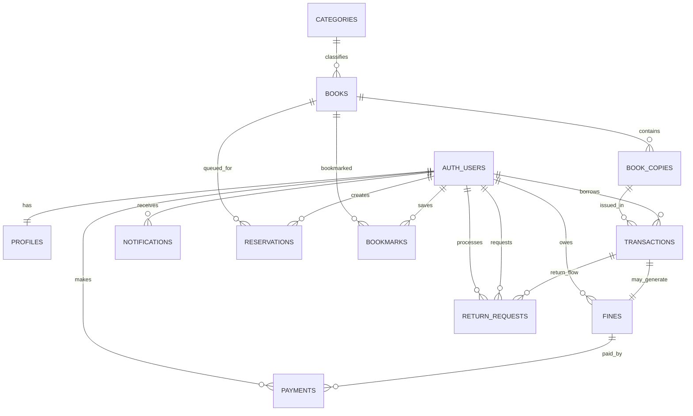

# IntelliLib Database Schema Reference

This document explains the final relational model used by IntelliLib.

For historical SQL evolution, see `docs/sqlFile.txt`.
For one-shot clean setup SQL, see `docs/sql.dump.sql`.

---

## 1) Domain Overview

| Domain | Tables | Responsibility |
|---|---|---|
| Identity and access | `profiles` (+ `auth.users`) | User profile, role, and account status |
| Catalog | `categories`, `books`, `book_copies` | Library inventory and copy-level states |
| Circulation | `transactions`, `reservations`, `return_requests` | Issue, return, and queue workflows |
| Finance | `fines`, `payments`, `system_settings` | Fine lifecycle, payment records, policy values |
| Communication | `notifications`, `bookmarks`, `ai_queries` | User messaging, saved books, assistant logging |
| Governance | `audit_logs` | Auditable operation trail |

---

## 2) Entity Relationship Summary

## 2.1 Core relationships

| Parent | Child | Key | Cardinality | Notes |
|---|---|---|---|---|
| `auth.users` | `profiles` | `profiles.id -> auth.users.id` | 1:1 | profile auto-created by trigger |
| `categories` | `books` | `books.category_id -> categories.id` | 1:N | optional category assignment |
| `books` | `book_copies` | `book_copies.book_id -> books.id` | 1:N | copy-level physical/digital units |
| `book_copies` | `transactions` | `transactions.book_copy_id -> book_copies.id` | 1:N | historical issue/return records |
| `auth.users` | `transactions` | `transactions.user_id -> auth.users.id` | 1:N | user circulation history |
| `transactions` | `fines` | `fines.transaction_id -> transactions.id` | 1:1 | enforced by unique index |
| `auth.users` | `fines` | `fines.user_id -> auth.users.id` | 1:N | user unpaid/paid fine records |
| `fines` | `payments` | `payments.fine_id -> fines.id` | 1:N | payment attempts and status |
| `auth.users` | `payments` | `payments.user_id -> auth.users.id` | 1:N | payer relationship |
| `auth.users` | `notifications` | `notifications.user_id -> auth.users.id` | 1:N | in-app notification stream |
| `auth.users` | `reservations` | `reservations.user_id -> auth.users.id` | 1:N | queue entries per user |
| `books` | `reservations` | `reservations.book_id -> books.id` | 1:N | queue entries per title |
| `transactions` | `return_requests` | `return_requests.transaction_id -> transactions.id` | 1:N | constrained to one pending at a time |
| `auth.users` | `return_requests` | `return_requests.user_id -> auth.users.id` | 1:N | requester |
| `auth.users` | `return_requests.processed_by` | `return_requests.processed_by -> auth.users.id` | 1:N | staff processor |
| `auth.users` | `bookmarks` | `bookmarks.user_id -> auth.users.id` | 1:N | saved items |
| `books` | `bookmarks` | `bookmarks.book_id -> books.id` | 1:N | many users can bookmark same book |

## 2.2 Mermaid ER diagram

---

## 3) Table Dictionary

## 3.1 `profiles`

| Column | Type | Null | Default | Constraints/Meaning |
|---|---|---|---|---|
| `id` | `uuid` | no | - | PK, FK to `auth.users.id`, cascades on delete |
| `created_at` | `timestamptz` | no | `now()` | creation timestamp |
| `full_name` | `text` | yes | - | user display name |
| `role` | `text` | no | `'user'` | enum-like check: `user/librarian/admin` |
| `avatar_url` | `text` | yes | - | profile photo URL |
| `status` | `text` | no | `'active'` | enum-like check: `active/suspended` |

Use:
- Controls role-based navigation and policy permissions.
- Suspension guard logic references account status.

## 3.2 `categories`

| Column | Type | Null | Default | Constraints/Meaning |
|---|---|---|---|---|
| `id` | `bigint` identity | no | auto | PK |
| `name` | `text` | no | - | unique category label |
| `created_at` | `timestamp` | no | `now()` | creation timestamp |

Use:
- Logical taxonomy for discovery and reporting.

## 3.3 `books`

| Column | Type | Null | Default | Constraints/Meaning |
|---|---|---|---|---|
| `id` | `bigint` identity | no | auto | PK |
| `title` | `text` | no | - | title |
| `author` | `text` | no | - | author |
| `description` | `text` | yes | - | summary |
| `type` | `text` | no | `physical` | check: `physical/digital/both` |
| `category_id` | `bigint` | yes | - | FK to `categories.id` |
| `isbn` | `text` | yes | - | unique ISBN |
| `cover_url` | `text` | yes | - | cover media |
| `pdf_url` | `text` | yes | - | digital copy URL |
| `publisher` | `text` | yes | - | publisher |
| `published_year` | `int` | yes | - | publishing year |
| `total_copies` | `int` | no | `0` | maintained by triggers |
| `available_copies` | `int` | no | `0` | maintained by triggers |
| `created_at` | `timestamp` | no | `now()` | creation timestamp |

Use:
- Main catalog record and search surface.
- Availability cards read from aggregate copy counters.

## 3.4 `book_copies`

| Column | Type | Null | Default | Constraints/Meaning |
|---|---|---|---|---|
| `id` | `bigint` identity | no | auto | PK |
| `book_id` | `bigint` | no | - | FK to `books.id` (cascade delete) |
| `type` | `text` | no | - | check: `physical/digital` |
| `status` | `text` | no | `available` | check: `available/issued/reserved/lost/maintenance` |
| `location` | `text` | yes | - | physical shelf/location |
| `access_url` | `text` | yes | - | digital access link |
| `condition` | `text` | yes | - | copy condition metadata |
| `created_at` | `timestamp` | no | `now()` | creation timestamp |

Constraint highlights:
- `check_location_access` ensures:
  - physical copy must have `location`
  - digital copy must have `access_url`

Use:
- Real source-of-truth for issueability and stock.
- Status synced by transaction triggers.

## 3.5 `transactions`

| Column | Type | Null | Default | Constraints/Meaning |
|---|---|---|---|---|
| `id` | `bigint` identity | no | auto | PK |
| `user_id` | `uuid` | no | - | FK to `auth.users` |
| `book_copy_id` | `bigint` | no | - | FK to `book_copies` |
| `issue_date` | `timestamp` | no | `now()` | issued at |
| `due_date` | `timestamp` | no | - | due date |
| `return_date` | `timestamp` | yes | - | return timestamp |
| `status` | `text` | no | `issued` | check: `issued/returned/overdue`, normalized by trigger |
| `fine_amount` | `int` | no | `0` | non-negative |
| `created_at` | `timestamp` | no | `now()` | creation timestamp |

Constraint highlights:
- `due_date >= issue_date`
- `return_date IS NULL OR return_date >= issue_date`
- unique open issue per copy: `unique_active_issue` on `(book_copy_id)` where `return_date IS NULL`

Use:
- Primary circulation ledger.
- Analytics source for due reminders and history panels.

## 3.6 `reservations`

| Column | Type | Null | Default | Constraints/Meaning |
|---|---|---|---|---|
| `id` | `bigint` identity | no | auto | PK |
| `user_id` | `uuid` | no | - | FK to `auth.users` |
| `book_id` | `bigint` | no | - | FK to `books` |
| `status` | `text` | no | `waiting` | check: `waiting/approved/cancelled/completed` |
| `queue_position` | `int` | yes | - | queue order |
| `created_at` | `timestamp` | no | `now()` | created timestamp |

Constraint highlights:
- unique queue slot for active rows:
  - `(book_id, queue_position)` where status in `waiting/approved`
- one active reservation per user/book:
  - `(user_id, book_id)` where status in `waiting/approved`

Use:
- Queueing unavailable books.
- Promotion into approved holds based on stock.

## 3.7 `return_requests`

| Column | Type | Null | Default | Constraints/Meaning |
|---|---|---|---|---|
| `id` | `bigint` identity | no | auto | PK |
| `transaction_id` | `bigint` | no | - | FK to `transactions`, cascade delete |
| `user_id` | `uuid` | no | - | FK to `auth.users`, cascade delete |
| `status` | `text` | no | `pending` | check: `pending/approved/rejected` |
| `requested_at` | `timestamp` | no | `now()` | request timestamp |
| `processed_at` | `timestamp` | yes | - | completion timestamp |
| `processed_by` | `uuid` | yes | - | staff FK to `auth.users` |
| `notes` | `text` | yes | - | staff notes |
| `created_at` | `timestamp` | no | `now()` | insertion timestamp |

Constraint highlights:
- one pending request per transaction:
  - unique index on `transaction_id` where status = `pending`

Use:
- Explicit user request and staff moderation workflow for returns.

## 3.8 `fines`

| Column | Type | Null | Default | Constraints/Meaning |
|---|---|---|---|---|
| `id` | `bigint` identity | no | auto | PK |
| `user_id` | `uuid` | no | - | FK to `auth.users` |
| `transaction_id` | `bigint` | no | - | FK to `transactions` |
| `amount` | `int` | no | - | positive amount |
| `status` | `text` | no | `pending` | check: `pending/paid` |
| `paid_at` | `timestamp` | yes | - | marks fine settled |
| `created_at` | `timestamp` | no | `now()` | creation timestamp |

Constraint highlights:
- one fine per transaction via `unique_fine_per_transaction`

Use:
- Financial penalty state and reconciliation anchor.

## 3.9 `payments`

| Column | Type | Null | Default | Constraints/Meaning |
|---|---|---|---|---|
| `id` | `bigint` identity | no | auto | PK |
| `user_id` | `uuid` | no | - | FK to `auth.users` |
| `fine_id` | `bigint` | no | - | FK to `fines`, cascade delete |
| `amount` | `int` | no | - | positive payment amount |
| `provider` | `text` | no | `razorpay` | payment rail |
| `razorpay_order_id` | `text` | yes | - | order reference |
| `razorpay_payment_id` | `text` | yes | - | provider payment reference |
| `razorpay_signature` | `text` | yes | - | verification signature |
| `status` | `text` | no | `created` | check: `created/success/failed` |
| `method` | `text` | yes | - | card/netbanking/wallet/etc |
| `bank` | `text` | yes | - | bank name if available |
| `wallet` | `text` | yes | - | wallet detail |
| `vpa` | `text` | yes | - | UPI VPA |
| `created_at` | `timestamp` | no | `now()` | created timestamp |

Constraint highlights:
- unique non-null `razorpay_payment_id`

Use:
- payment audit log and reconciliation source.

## 3.10 `notifications`

| Column | Type | Null | Default | Constraints/Meaning |
|---|---|---|---|---|
| `id` | `bigint` identity | no | auto | PK |
| `user_id` | `uuid` | no | - | FK to `auth.users` |
| `type` | `text` | yes | - | due/fine/payment/reservation type |
| `message` | `text` | no | - | in-app message |
| `is_read` | `boolean` | no | `false` | read state |
| `target_role` | `text` | yes | - | optional role targeting metadata |
| `metadata` | `jsonb` | yes | - | optional contextual payload |
| `created_at` | `timestamp` | no | `now()` | created timestamp |

Use:
- user notification feed and action-required prompts.

## 3.11 `audit_logs`

| Column | Type | Null | Default | Constraints/Meaning |
|---|---|---|---|---|
| `id` | `bigint` identity | no | auto | PK |
| `user_id` | `uuid` | yes | - | actor id when available |
| `action` | `text` | no | - | verb (issue, return, suspend, etc.) |
| `entity` | `text` | yes | - | affected entity type |
| `entity_id` | `bigint` | yes | - | affected entity id |
| `metadata` | `jsonb` | yes | - | event details |
| `created_at` | `timestamp` | no | `now()` | event timestamp |

Use:
- operational compliance and troubleshooting.

## 3.12 `ai_queries`

| Column | Type | Null | Default | Constraints/Meaning |
|---|---|---|---|---|
| `id` | `bigint` identity | no | auto | PK |
| `user_id` | `uuid` | yes | - | requesting user |
| `query` | `text` | no | - | user prompt/question |
| `response` | `text` | yes | - | model output |
| `context` | `jsonb` | yes | - | assistant context payload |
| `created_at` | `timestamp` | no | `now()` | execution timestamp |

Use:
- assistant analytics and troubleshooting.

## 3.13 `bookmarks`

| Column | Type | Null | Default | Constraints/Meaning |
|---|---|---|---|---|
| `id` | `bigint` identity | no | auto | PK |
| `user_id` | `uuid` | no | - | FK to `auth.users` |
| `book_id` | `bigint` | no | - | FK to `books` |
| `created_at` | `timestamptz` | no | `now()` | bookmark timestamp |

Constraint highlights:
- unique pair `(user_id, book_id)` prevents duplicate bookmarks.

Use:
- personalized saved title list.

## 3.14 `system_settings`

| Column | Type | Null | Default | Constraints/Meaning |
|---|---|---|---|---|
| `id` | `bigint` identity | no | auto | PK |
| `max_books_per_user` | `int` | no | `3` | max concurrent borrow count |
| `max_days_allowed` | `int` | no | `14` | standard due window |
| `fine_per_day` | `int` | no | `5` | fine rate |
| `created_at` | `timestamp` | no | `now()` | policy timestamp |

Use:
- policy source used by circulation services.

---

## 4) Trigger and Function Catalog

| Function | Trigger/Usage | Purpose |
|---|---|---|
| `handle_new_user()` | `on_auth_user_created` | auto-create profile row for new auth user |
| `update_book_counts()` | `trg_book_copy_insert/update/delete` | keep `books.total_copies` and `available_copies` synchronized |
| `normalize_transaction_status()` | `trg_normalize_transaction_status` | derive status from due/return dates |
| `validate_transaction_rules()` | `trg_validate_transaction_rules` | block invalid issue updates (overdue/duplicate active copy) |
| `refresh_book_copy_status()` | called by sync trigger | compute copy status from open transactions |
| `sync_book_copy_status_from_transactions()` | `trg_sync_book_copy_status_from_transactions` | synchronize `book_copies.status` on tx changes |
| `validate_reservation_no_active_issue()` | `trg_validate_reservation_no_active_issue` | block reservation if user already holds same title |
| `promote_waiting_reservations(p_book_id, p_limit)` | RPC-style function | promote waiting queue entries to approved |
| `mark_transaction_returned_on_fine_payment()` | `trg_mark_transaction_returned_on_fine_payment` | auto-close transaction after fine payment |
| `current_user_role()` | policy helper | resolve role from `profiles` |
| `is_staff()` | policy helper | role helper for admin/librarian checks |

---

## 5) Important Uniqueness and Guardrails

| Rule | Enforcement |
|---|---|
| One open issue per copy | unique partial index `unique_active_issue` |
| One active reservation per user/book | unique partial index `unique_active_reservation_per_user_book` |
| Unique queue slot per active book queue | unique partial index `unique_queue_position_active` |
| One pending return request per transaction | unique partial index `uniq_return_request_pending_per_tx` |
| One fine per transaction | unique index `unique_fine_per_transaction` |
| No duplicate successful provider payment id | unique partial index `uniq_payments_razorpay_payment_id` |
| No negative/invalid amounts and dates | CHECK constraints on `transactions`, `fines`, `payments` |

---

## 6) RLS Strategy Summary

RLS is enabled on domain tables and split by role and ownership:

- Read-all, write-staff model for catalog entities (`books`, `book_copies`, `categories`).
- Owner-or-staff read/update model for user-owned entities (`transactions`, `reservations`, `notifications`, `payments`, `fines`).
- Staff-only reads for `audit_logs`.
- Admin-only write policy for `system_settings`.
- `return_requests` allows user creation, staff moderation.
- `bookmarks` allows owner-or-staff CRUD subset.

---

## 7) Realtime Registration

The following tables are registered to `supabase_realtime` publication (if publication exists):

- `public.return_requests`
- `public.bookmarks`

This supports dashboard updates without manual refresh for these flows.

---

## 8) Setup Recommendation

For a new environment:

1. Run `docs/sql.dump.sql` once.
2. Verify all triggers/functions exist in Supabase SQL editor.
3. Confirm role values in `profiles` are valid (`user`, `librarian`, `admin`).
4. Validate reservation promotion RPC by calling `promote_waiting_reservations` with a test `book_id`.
5. Keep `docs/sqlFile.txt` only as historical reference, not as primary bootstrap script.
